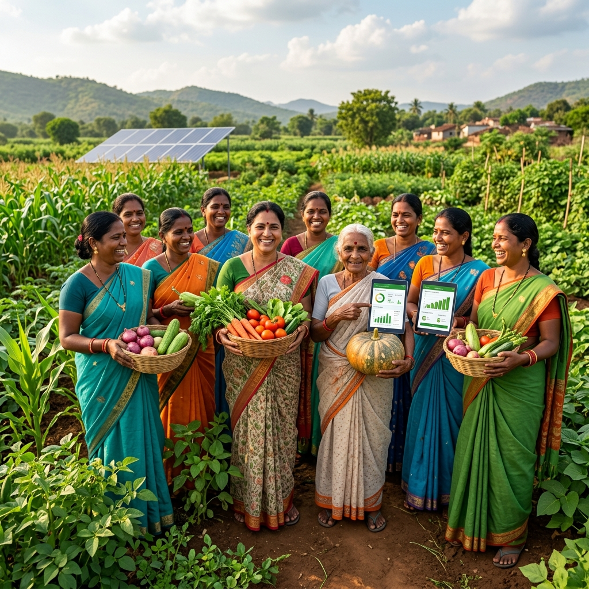
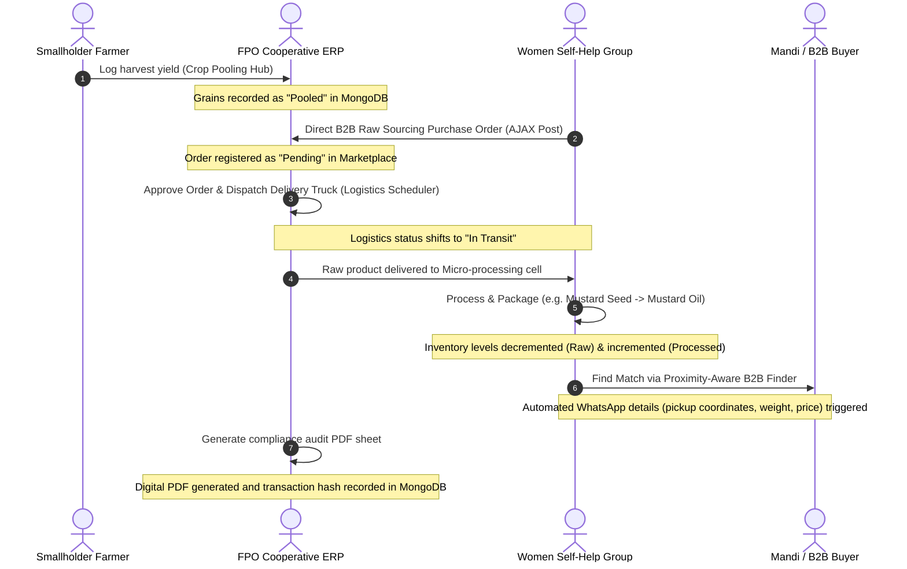

# 🌾 FarmTech MIS: Dual-Platform Agriculture Value-Chain Integrator

[](https://laravel.com)
[](https://mongodb.com)
[](https://tailwindcss.com)
[](https://php.net)
[](LICENSE)

FarmTech MIS is a high-fidelity, dual-platform digital ecosystem specifically engineered to address the systemic challenges of agricultural fragmentation in rural communities. By creating seamless structural pathways between individual smallholder farmers, aggregate cooperatives (**Farmer Producer Organizations - FPOs**), and micro-processing cells (**Self-Help Groups - SHGs**), the platform enables decentralized groups to leverage collective volume, scale up sourcing quality, and cut intermediate leakage.

---

## 📸 Platform Preview
Our custom interface connects three core pillars of the rural economy through a highly responsive dashboard architecture:



---

## 🏛 Key Architectural Pillars

```
                     ┌───────────────────────────┐
                     │   FarmTech MIS Portal     │
                     └─────────────┬─────────────┘
                                   │
         ┌─────────────────────────┼─────────────────────────┐
         ▼                         ▼                         ▼
┌──────────────────┐      ┌──────────────────┐      ┌──────────────────┐
│  👩‍🌾 Farmer Hub   │      │ 📦 FPO Aggregator│      │  👩‍🏭 SHG Processor │
│                  │      │       (ERP)      │      │     (Micro)      │
├──────────────────┤      ├──────────────────┤      ├──────────────────┤
│ • Yield Pooling  │      │ • Batch Pooling  │      │ • B2B Sourcing   │
│ • AI Schemes     │      │ • Fleet Booking  │      │ • Processing Logs│
│ • Soil Cards     │      │ • GIS Maps Layer │      │ • Custom Brand AI│
│ • Mandi Prices   │      │ • Audit Reports  │      │ • WhatsApp Alerts│
└──────────────────┘      └──────────────────┘      └──────────────────┘
```

### 1. 👩‍🌾 Farmer Dashboard
- **Yield Pooling**: Log individual harvests directly into a centralized system to form large-scale commercial batches.
- **AI-Powered Schemes**: Personalize government agricultural subsidy matching based on land size, location, and crop profile.
- **Interactive Soil Health Cards**: Input soil metrics and receive smart recommendations for fertilizer application.
- **Real-time Mandi Prices**: Query live agricultural commodity market rates to make data-backed sale decisions.

### 2. 📦 Farmer Producer Organization (FPO) ERP
- **Crop Pooling Hub**: Group small-scale smallholder yields into standardized, bulk commercial batches (e.g., Basmati Rice, Wheat, Mustard).
- **Logistics & Fleet Scheduling**: Plan vehicle routes, dispatch trucks, estimate shipping costs, and track delivery status.
- **Proximity GIS Map**: vector maps (via Leaflet and OpenStreetMap) indicating farm cluster zones and member landholdings.
- **Government Compliance Reports**: Automatically generate PDF rosters conforming to State Department of Agriculture guidelines, secured with unique database hashes.

### 3. 👩‍🏭 Women-led Self-Help Group (SHG) Portal
- **Direct B2B Sourcing**: Procurement of raw ingredients directly from the FPO at fair wholesale prices, eliminating middlemen.
- **Micro-ERP Sourcing Logs**: Log processing phases (e.g., cold-pressing mustard seeds into branded mustard oil bottles).
- **AI Incubator & Branding**: Leverage built-in AI assists to generate brand names, product packaging guidelines, and descriptions.
- **Proximity-Aware Buyer Finder**: Discover B2B retail buyers and storage warehouses within a 15-50km spatial radius.

---

## 🔄 Value-Chain & Sourcing Flow

The sequence below outlines how FarmTech MIS aggregates raw materials from small fields and routes them to processed retail stores:



---

## 🛠 Tech Stack Specification

| Layer / Component | Technology Used | Operational Responsibility |
| :--- | :--- | :--- |
| **Backend Framework** | Laravel 12.0 / PHP 8.2+ | REST APIs, route controls, MVC architecture, seeders, validation |
| **Database Engine** | MongoDB v6.0+ | Hybrid NoSQL integration via Laravel MongoDB Driver (audit logs, rosters, inventory logs) |
| **Frontend Styling** | Tailwind CSS v4.0 | Fully custom glassmorphism design, theme presets, responsive layout |
| **Interactivity Layer**| Alpine.js / Fetch API | Real-time single-page feel (SPA dashboard tab swaps, background forms) |
| **GIS Mapping** | Leaflet.js / OpenStreetMap | Local spatial radius calculations and interactive farm pins |
| **PDF Reporting** | html2pdf.js / Dompdf PHP | Dynamic audit documentation generation and server-side storage |

### Hybrid MongoDB Schema Example (Audit Log)
```php
// App\Models\ReportAuditLog
class ReportAuditLog extends Model {
    protected $connection = 'mongodb';
    protected $collection = 'report_audit_logs';
    protected $fillable = [
        'user_id', 'hash_code', 'report_type', 
        'metrics', 'authority', 'status', 'created_at'
    ];
}
```

---

## 🚀 Local Installation & Setup

### Prerequisites
- **PHP 8.2+**
- **Composer**
- **Node.js & npm**
- **MongoDB** (running locally or a MongoDB Atlas instance URI)

### Step 1: Clone and Install Dependencies
```bash
# Clone the repository
git clone https://github.com/shahanwajkhan/FarmTech-MIS.git
cd FarmTech-MIS

# Install PHP dependencies
composer install

# Install Frontend dependencies
npm install
```

### Step 2: Environment Configuration
Create a `.env` file by copying the example:
```bash
cp .env.example .env
```
Update your database configuration settings inside `.env`:
```ini
DB_CONNECTION=mongodb
DB_URI=mongodb://127.0.0.1:27017/farmtech_db
```

### Step 3: Run Database Migrations and Seeders
Initialize database collections and fill them with high-fidelity testing datasets:
```bash
# Run migrations
php artisan migrate

# Seed dummy Farmers, FPOs, and SHGs
php artisan db:seed
```

### Step 4: Run the Application
Launch both the PHP application server and the Vite compiler concurrently:
```bash
# Start Vite development compiler
npm run dev

# Start Laravel local server (in a separate terminal)
php artisan serve
```
Open [http://localhost:8000](http://localhost:8000) in your web browser.

---

## 🧪 Demo Login Credentials

For testing and demonstrating the distinct dashboards:

* **FPO Cooperative Manager**
  - **Login URL**: [http://localhost:8000/force-login-fpo](http://localhost:8000/force-login-fpo) (Instant bypass) or `/login`
  - **Email**: `greenharvest@farmtech.com`
  - **Password**: `password`

* **SHG Cell Representative**
  - **Login URL**: [http://localhost:8000/force-login](http://localhost:8000/force-login) (Instant bypass) or `/login`
  - **Email**: `maashakti@farmtech.com`
  - **Password**: `password`

---

## 📘 Documentation
For a deep dive into the integration hooks, spatial queries, and system modules, view the [FarmTech Architecture Guide (PDF)](public/FarmTech_MIS_FPO_SHG_Architecture_Guide.pdf).

---

Developed by the FarmTech Development & Systems Team. Licensed under the [MIT License](LICENSE).
